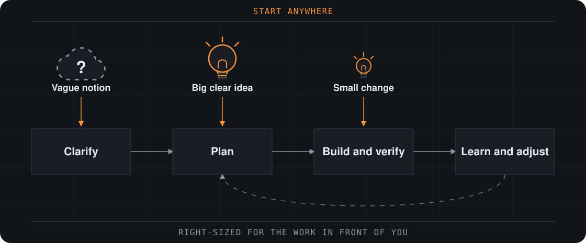

[](https://github.com/DavidBatoDev/fmad-method/tags)
[](LICENSE)
[](https://davidbatodev.github.io/fmad-method/)

[English](README.md) | 简体中文 | [Tiếng Việt](README_VN.md) | [한국어](README_KR.md)

**FMAD —— Foundry Method for Agile AI-Driven Development（敏捷 AI 驱动开发的 Foundry 方法）。把想法或变更请求变成可运行的软件，而不放弃思考。**

AI 驱动开发涵盖的是整项工作，而不只是代码：做什么、各部分如何组织成一个整体，以及随着认识加深如何调整。Foundry Method 是实践它的一种敏捷方式。决策保持显式，上下文持续传递，流程随工作量自动调整。小改动直接进入构建，复杂工作获得所需的深度。同一套方法既适用于黑客松原型，也适用于有多年历史的系统。



_从任何环节开始。你可以端到端地使用 FMAD，也可以把它产出的简报、规格说明和架构设计带入你现有的交付流程。_

## 开始构建

你需要一个支持技能（skills）的 AI 编程工具（Claude Code、Codex、Cursor 等），用于 FMAD 设置和 Python 脚本的 [uv](https://docs.astral.sh/uv/)，以及供 Skills CLI 使用的 [Node.js 和 npm](https://nodejs.org) 与 Git。在你的项目中运行：

```bash
npx skills add DavidBatoDev/fmad-method
```

选择你需要的技能和编程工具。请包含用于设置和帮助的 `fmad`，以及你所选技能所属的每个模块的模块记录：`fmod-method` 和 `fmod-core-tools`。如果想改为按名称安装，请把它们一起列出：

```bash
npx skills add DavidBatoDev/fmad-method --skill fmad --skill fmod-core-tools --skill fmod-method --skill fmad-build
```

在项目中打开你的编程工具，让 `fmad` 技能运行 `fmad setup`。然后调用 `fmad-build`，并说明你想做的改动。想了解下一步做什么、哪些步骤是可选的，随时询问 `fmad`。

**[用 FMAD 构建你的第一个项目 →](https://davidbatodev.github.io/fmad-method/start/build-your-first-change/)**

**[将 FMAD 添加到现有代码库 →](https://davidbatodev.github.io/fmad-method/existing-codebases/start-in-an-existing-codebase/)**

让 `fmad` 运行 `fmad status`，即可检查版本并查看下一步该运行什么。让它运行 `fmad setup` 即可安装更新：它会运行 `npx skills update`，然后刷新项目，并清理已重命名和已移除的技能。

## 为什么选择 FMAD？

编程助手擅长实现，但常常把未明说的假设直接写进代码。FMAD 让你始终保持掌控，同时由它的智能体和工作流把重要决策显式化，并将其保留为后续工作的上下文。

- **规模适配的流程** —— 清晰的改动可直接进入实现，较大的项目则可加入更深入的规划。
- **新代码或现有代码** —— 从零开始，或在你接手的代码库上建立经过验证的上下文，基于代码的实际情况开展工作。
- **持久的上下文** —— 让产品和技术决策持续传递下去，而不必在每次对话中重新解释。
- **专业视角** —— 在有帮助时引入产品、架构、UX、开发和测试方面的专业知识。
- **引导式协作** —— 使用结构化工作流和多智能体讨论，而无需交出判断权。
- **一条交付路径** —— 从早期构思出发，贯穿经过评审的实现、修正与学习。

[了解一个改动需要多少规划 →](https://davidbatodev.github.io/fmad-method/plan/choose-a-planning-path/)

## Foundry 团队

FMAD 提供两个模块。`fmod-method` 包含交付工作流，`fmod-core-tools` 包含 `fmad` 中枢和独立工具。这些具名智能体可以为任何对话带来各自的视角，既可以逐一引入，也可以在 `fmad-party-mode` 中共同参与。

| 智能体 | 技能 | 带来的视角 |
| --- | --- | --- |
| 📊 **Ember** —— 业务分析师 | `fmad-agent-analyst` | 市场与领域研究、证据优先的探索 |
| 📋 **Flint** —— 产品经理 | `fmad-agent-pm` | 待完成的工作（Jobs-to-be-done）、需求、犀利的“为什么？”追问 |
| 🎨 **Sienna** —— UX 设计师 | `fmad-agent-ux-designer` | 用户旅程、交互设计、先有界面再写代码 |
| 🏗️ **Ferris** —— 系统架构师 | `fmad-agent-architect` | 刻意选择的朴素技术、权衡取舍、规模扩大时哪里会出问题 |
| 💻 **Cinder** —— 高级软件工程师 | `fmad-agent-dev` | 测试先行的实现，简洁如提交信息 |

工作流覆盖循环的其余部分：`fmad-brainstorming`、`fmad-forge-idea`、`fmad-product-brief`、`fmad-prfaq`、`fmad-deep-recon`、`fmad-prd`、`fmad-ux`、`fmad-architecture`、`fmad-spec`、`fmad-ticket`、`fmad-build`、`fmad-build-auto`、`fmad-code-review`、`fmad-review`、`fmad-walkthrough`、`fmad-qa-generate-e2e-tests`、`fmad-correct-course`、`fmad-retrospective`、`fmad-project-context`、`fmad-customize` 和 `fmad-advanced-elicitation`。参见[技能与智能体参考](https://davidbatodev.github.io/fmad-method/reference/skills-and-agents/)。

## 在网页端规划

[Web 包](web-bundles/)将部分 FMAD 工作流打包为 Google Gemini Gems 和 ChatGPT Custom GPTs。你可以借助现有的网页版订阅进行规划，再把产出的成果带入 AI 编程工具中实施。压缩包附在 [Releases](https://github.com/DavidBatoDev/fmad-method/releases) 中。

## 文档

- **[构建你的第一个改动](https://davidbatodev.github.io/fmad-method/start/build-your-first-change/)** —— 安装 FMAD 并构建一个小项目。
- **[选择规划路径](https://davidbatodev.github.io/fmad-method/plan/choose-a-planning-path/)** —— 决定一个改动需要多少规划，并了解每个规划技能会产出什么。
- **[从现有代码库开始](https://davidbatodev.github.io/fmad-method/existing-codebases/start-in-an-existing-codebase/)** —— 将 FMAD 添加到现有代码库。

## 反馈

FMAD 是我为自己的项目和黑客松准备的个人工具包，分享出来，希望对你也有帮助。

- [GitHub Issues](https://github.com/DavidBatoDev/fmad-method/issues) —— 报告错误、提出功能请求。
- [GitHub Discussions](https://github.com/DavidBatoDev/fmad-method/discussions) —— 提问和分享想法。

提交 pull request 之前，请先阅读 [CONTRIBUTING.md](CONTRIBUTING.md)。

## 致谢

FMAD 深受 BMad Code, LLC 的 [BMAD-METHOD™](https://github.com/bmad-code-org/BMAD-METHOD) 启发，并派生自该项目；该项目以 MIT 许可证发布。FMAD 重命名了技能、模块和人物角色，并更改了品牌标识，但方法、工作流以及大量文本均来自该项目。其底层理念的功劳归于该项目的作者和贡献者。详见 [NOTICE.md](NOTICE.md)。

FMAD 是一个独立项目。它与 BMad Code, LLC 没有关联，也未获得 BMad Code, LLC 的认可或赞助。BMad™、BMad Method™ 和 BMAD-METHOD™ 是 BMad Code, LLC 的商标。

## 许可证

MIT 许可证。详见 [LICENSE](LICENSE)。
