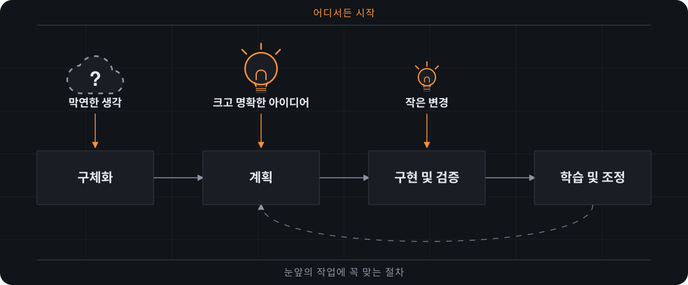

[](https://github.com/DavidBatoDev/fmad-method/tags)
[](LICENSE)
[](https://davidbatodev.github.io/fmad-method/)

[English](README.md) | [简体中文](README_CN.md) | [Tiếng Việt](README_VN.md) | 한국어

**FMAD — Foundry Method for Agile AI-Driven Development. 사고 과정을 포기하지 않고 아이디어나 변경 요청을 실제 작동하는 소프트웨어로 바꿉니다.**

AI 주도 개발은 코드 작성에 그치지 않습니다. 무엇을 만들지, 각 요소가 어떻게 맞물리는지, 새롭게 알게 된 내용에 따라 어떻게 바뀌는지까지 작업 전반을 아우릅니다. Foundry Method는 이를 애자일 방식으로 실천합니다. 결정은 명확히 남고 컨텍스트는 다음 작업으로 이어지며 절차는 작업 규모에 맞춰 조정됩니다. 작은 변경은 바로 구현으로 넘어갑니다. 복잡한 작업은 필요한 만큼 깊이 다룹니다. 해커톤 프로토타입부터 수년의 역사를 지닌 시스템까지 같은 방법으로 다룹니다.



_어디서든 시작하세요. FMAD를 처음부터 끝까지 사용해도 되고, FMAD의 개요, 사양, 아키텍처를 기존 개발 워크플로로 가져가도 됩니다._

## 바로 시작하기

스킬을 지원하는 AI 코딩 도구(Claude Code, Codex, Cursor 등), FMAD 설정과 Python 스크립트에 필요한 [uv](https://docs.astral.sh/uv/), 그리고 Skills CLI에 필요한 [Node.js와 npm](https://nodejs.org) 및 Git이 있어야 합니다. 프로젝트에서 다음 명령을 실행하세요.

```bash
npx skills add DavidBatoDev/fmad-method
```

원하는 스킬과 코딩 도구를 선택하세요. 설정과 도움말을 위한 `fmad`와 함께, 스킬을 고른 각 모듈의 모듈 레코드인 `fmod-method`와 `fmod-core-tools`도 포함하세요. 대신 이름으로 설치하려면 다음과 같이 함께 나열하세요.

```bash
npx skills add DavidBatoDev/fmad-method --skill fmad --skill fmod-core-tools --skill fmod-method --skill fmad-build
```

프로젝트에서 코딩 도구를 열고 `fmad` 스킬에 `fmad setup`을 실행해 달라고 요청하세요. 그런 다음 원하는 변경 사항과 함께 `fmad-build`를 호출하세요. 다음 단계나 선택 사항을 안내받고 싶을 때는 언제든 `fmad`에 물어보세요.

**[FMAD로 첫 프로젝트 만들기 →](https://davidbatodev.github.io/fmad-method/ko-kr/start/build-your-first-change/)**

**[기존 코드베이스에 FMAD 추가하기 →](https://davidbatodev.github.io/fmad-method/existing-codebases/start-in-an-existing-codebase/)**

버전을 확인하고 다음에 실행할 항목을 보려면 `fmad status`를 요청하세요. 업데이트를 설치하려면 `fmad setup`을 요청하세요. 이 명령은 `npx skills update`를 실행한 다음 프로젝트를 새로 고치고 이름이 바뀌었거나 제거된 스킬을 정리합니다.

## 왜 FMAD인가요?

코딩 도우미는 구현에는 능숙하지만 명시하지 않은 가정을 그대로 코드로 옮기는 경우가 많습니다. FMAD는 주도권을 사용자에게 두면서, 에이전트와 워크플로를 통해 중요한 결정을 명확히 드러내고 이후 작업에 필요한 컨텍스트로 남깁니다.

- **작업에 맞는 절차** — 명확한 변경은 바로 구현하고 큰 과제는 더 깊이 계획합니다.
- **신규·기존 코드 모두 지원** — 빈 상태에서 시작하거나, 물려받은 코드베이스에서 검증된 컨텍스트를 확보해 실제로 있는 코드를 기준으로 작업합니다.
- **지속되는 컨텍스트** — 대화할 때마다 다시 설명하지 않아도 제품과 기술 결정을 다음 작업으로 이어 갑니다.
- **분야별 관점** — 필요할 때 제품, 아키텍처, UX, 개발, 테스트 전문가의 관점을 활용합니다.
- **안내형 협업** — 판단을 맡기지 않고도 구조화된 워크플로와 여러 에이전트의 토론을 활용합니다.
- **하나로 이어지는 개발 흐름** — 초기 구상부터 검토를 거친 구현, 방향 수정, 학습까지 한 흐름으로 진행합니다.

[변경에 필요한 계획 수준 알아보기 →](https://davidbatodev.github.io/fmad-method/plan/choose-a-planning-path/)

## Foundry 크루

FMAD는 두 개의 모듈을 제공합니다. `fmod-method`에는 전달 워크플로가, `fmod-core-tools`에는 `fmad` 허브와 단독 실행 도구가 들어 있습니다. 이름이 있는 에이전트는 어떤 대화에서든 각자의 관점을 더하며, 한 번에 한 명씩 참여하거나 `fmad-party-mode`에서 함께 참여합니다.

| 에이전트 | 스킬 | 제공하는 것 |
| --- | --- | --- |
| 📊 **Ember** — 비즈니스 분석가 | `fmad-agent-analyst` | 시장 및 도메인 조사, 근거를 우선하는 탐색 |
| 📋 **Flint** — 제품 관리자 | `fmad-agent-pm` | Jobs-to-be-done, 요구 사항, 날카로운 "왜?" 질문 |
| 🎨 **Sienna** — UX 디자이너 | `fmad-agent-ux-designer` | 사용자 여정, 인터랙션 디자인, 코드보다 먼저 그리는 화면 |
| 🏗️ **Ferris** — 시스템 아키텍트 | `fmad-agent-architect` | 일부러 지루하게 고른 기술, 트레이드오프, 규모가 커질 때 무너지는 부분 |
| 💻 **Cinder** — 시니어 소프트웨어 엔지니어 | `fmad-agent-dev` | 커밋 메시지처럼 간결한 테스트 우선 구현 |

루프의 나머지는 워크플로가 담당합니다. `fmad-brainstorming`, `fmad-forge-idea`, `fmad-product-brief`, `fmad-prfaq`, `fmad-deep-recon`, `fmad-prd`, `fmad-ux`, `fmad-architecture`, `fmad-spec`, `fmad-ticket`, `fmad-build`, `fmad-build-auto`, `fmad-code-review`, `fmad-review`, `fmad-walkthrough`, `fmad-qa-generate-e2e-tests`, `fmad-correct-course`, `fmad-retrospective`, `fmad-project-context`, `fmad-customize`, `fmad-advanced-elicitation`이 있습니다. 자세한 내용은 [스킬 및 에이전트 참조](https://davidbatodev.github.io/fmad-method/reference/skills-and-agents/)를 확인하세요.

## 웹에서 계획하기

[웹 번들](web-bundles/)은 일부 FMAD 워크플로를 Google Gemini Gem과 ChatGPT Custom GPT로 패키징한 것입니다. 기존 웹 구독 환경에서 계획을 세운 뒤, 그 결과물을 AI 코딩 도구로 가져와 구현에 사용하세요. 압축된 번들은 [릴리스](https://github.com/DavidBatoDev/fmad-method/releases)에 첨부되어 있습니다.

## 문서

- **[첫 변경 사항 구현하기](https://davidbatodev.github.io/fmad-method/ko-kr/start/build-your-first-change/)** — FMAD를 설치하고 작은 프로젝트를 만듭니다.
- **[계획 경로 선택하기](https://davidbatodev.github.io/fmad-method/plan/choose-a-planning-path/)** — 변경에 필요한 계획 수준을 정하고 각 계획 스킬이 무엇을 만들어 내는지 살펴봅니다.
- **[기존 코드베이스에서 시작하기](https://davidbatodev.github.io/fmad-method/existing-codebases/start-in-an-existing-codebase/)** — 기존 코드베이스에 FMAD를 추가합니다.

## 피드백

FMAD는 제 프로젝트와 해커톤을 위해 만든 개인 툴킷이며, 여러분에게도 도움이 될까 하여 공유합니다.

- [GitHub Issues](https://github.com/DavidBatoDev/fmad-method/issues) — 버그를 제보하고 기능을 요청합니다.
- [GitHub Discussions](https://github.com/DavidBatoDev/fmad-method/discussions) — 질문하고 아이디어를 나눕니다.

Pull Request를 열기 전에 [CONTRIBUTING.md](CONTRIBUTING.md)를 읽어 주세요.

## 감사의 말

FMAD는 BMad Code, LLC의 [BMAD-METHOD™](https://github.com/bmad-code-org/BMAD-METHOD)에서 많은 영감을 받았으며 BMAD-METHOD™에서 파생되었습니다. BMAD-METHOD™는 MIT 라이선스로 배포됩니다. FMAD는 스킬, 모듈, 페르소나의 이름을 바꾸고 브랜딩을 변경했지만, 방법론과 워크플로, 그리고 텍스트의 상당 부분은 해당 프로젝트에서 가져왔습니다. 그 바탕이 되는 아이디어에 대한 공로는 해당 프로젝트의 저작자와 기여자에게 있습니다. 자세한 내용은 [NOTICE.md](NOTICE.md)를 참고하세요.

FMAD는 독립 프로젝트입니다. FMAD는 BMad Code, LLC와 제휴 관계가 없으며, BMad Code, LLC가 보증하거나 후원하는 프로젝트도 아닙니다. BMad™, BMad Method™, BMAD-METHOD™는 BMad Code, LLC의 상표입니다.

## 라이선스

MIT 라이선스를 따릅니다. 자세한 내용은 [LICENSE](LICENSE)를 참고하세요.
